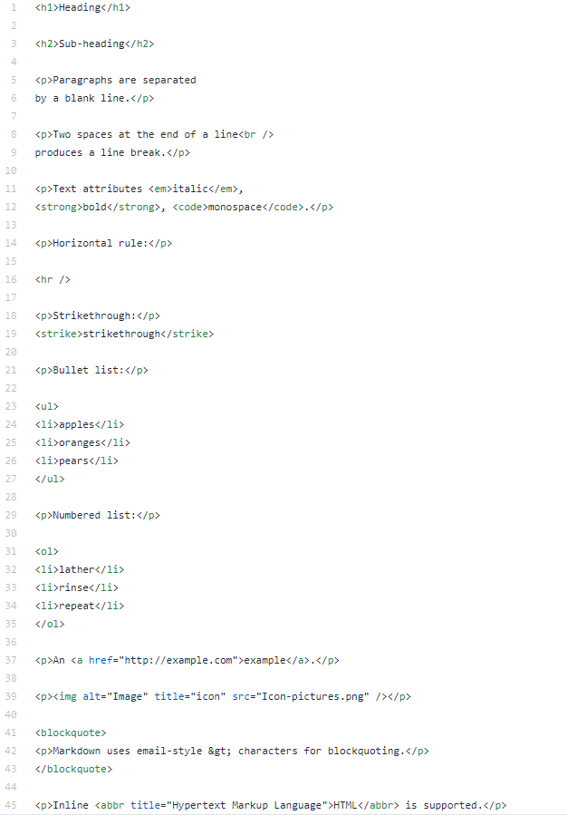
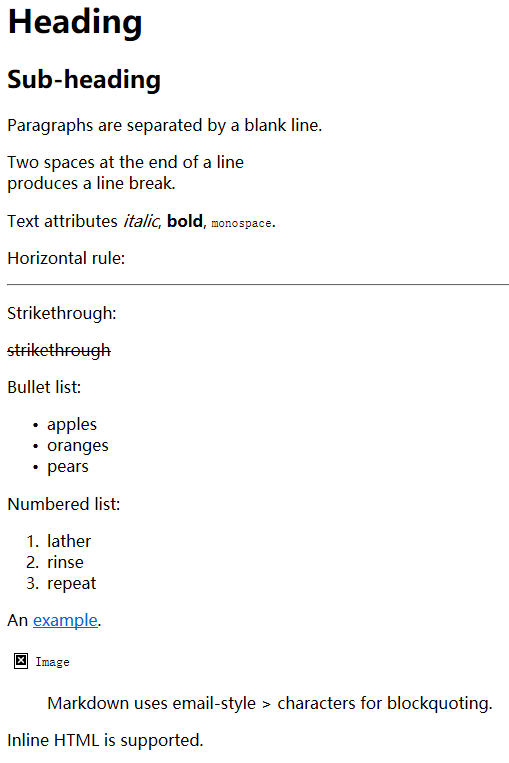
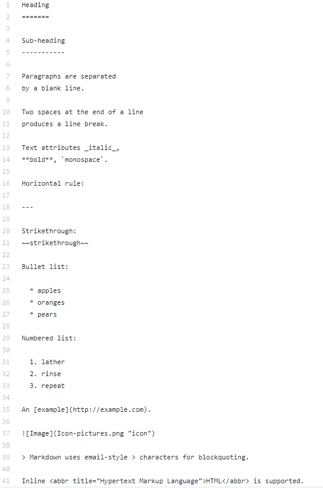
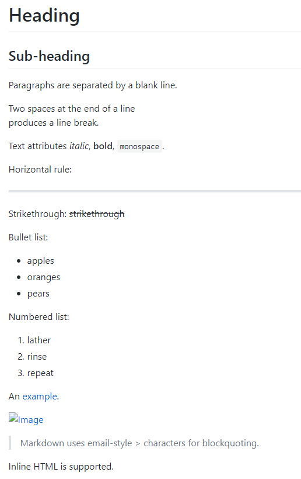

Markdown——what you see is what you get
======================================
这是Markdown的[维基百科](https://en.wikipedia.org/wiki/Markdown),内有清晰的对照表，说明应该有软件Markdown转换HTML。

HTML是Hyper Text Markup Language.  
而Markdown是轻量级标记语言，对应 HTML 标记的一小部分，涵盖纯文本可以涵盖的范围，并且支持LaTeX！GitHub的README.md就用此语言。  
下面两者的实际显示图是基本一样的！

这是HTML及其在EDGE浏览器的呈现：
-----------------------------

这是Markdown及其在GitHub的呈现：
------------------------------

我发现md和html语言中图片名不能带空格（正如github的repository（库）也不能有空格（空格换成了-），github的用户名也是！），图片名后缀还分大小写。段落中按一个空格就是空格，多个空格加&amp;nbsp;（注意！在markdown或者也就是HTML里输入的是&amp;amp;nbsp;）。

段落按html（&lt;hr /&gt;)或markdown（双空格并回车）会断线，否则会一直向右直到显示界面最右端才断线（总得有个头不是）。（两个半书名号用于标签的开始和结束，所以用字符转换表示真正的这两个符号）
